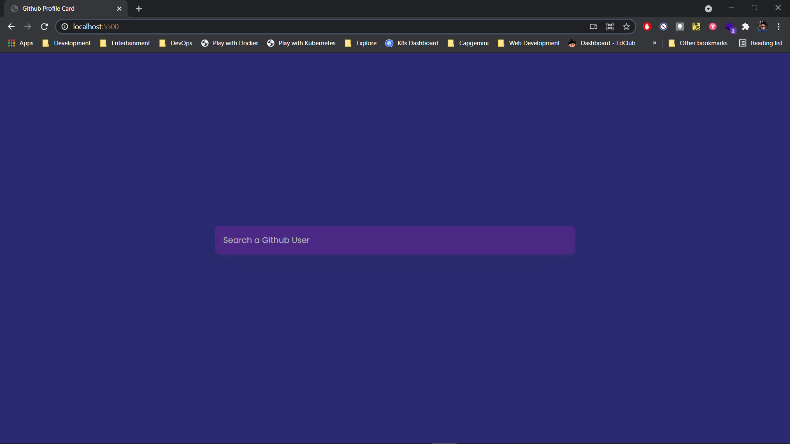

# Github Profile Card

- [Github Profile Card](#github-profile-card)
  - [Deployment](#deployment)
  - [Description](#description)
  - [Screenshots](#screenshots)

## Deployment

- Checkout deployment at <https://gagandeep39.github.io/css-github-profile-card>

## Description

- Github Profile card created using HTML + CSS
- Uses JS fetch API
- Displays a list of users after entering any username

## Screenshots

